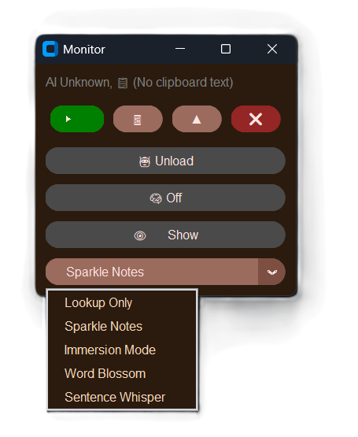
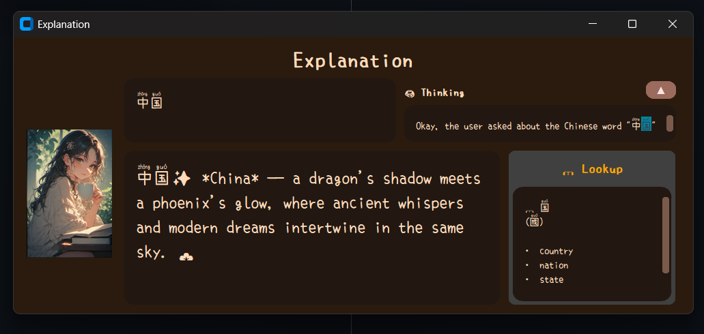

<!--  -->
<h1 align="center">
    <!--  -->
    Sec. Lulu
    <!--   -->
</h1>

> 

> 
> Stop looking up words. Start living them.
In the flow of reading or browsing, every unfamiliar word is an opportunity lost to the friction of switching tabs. Sec. Lulu - an AI language learning assistant - hopes to bridge that gap by **recording new words as you go**, tailoring them into a **structured learning program** just for you.

Instead of static dictionary entries, you receive AI-driven insights, usage examples, and creative stories that turn abstract characters into memorable concepts.

The setup is local, no cloud, no data collection. Just you and your language learning journey.

**Currently supporting:**

- Chinese

> 

## Features

- Monitors **unfamiliar Chinese content (words, sentences...)** as you go (currently supporting: clipboard monitoring)
- Interactive AI response with **5 built-in modes**, integrated look-up
- Organises learning data into a personal profile
- *Daily "What you learned" summaries with tips, reviews and exercises (in progress*)

### Modes

> 

- **Lookup-only**: fastest, breaks down content and looks individual words on local dictionary
- **✨ Sparkle Notes**: one quick, memorable word image
- **🌸 Immersion Mode**: an immersive experience surrounding the word
- **🌼 Word Blossom Mode**: provides abstract images of words, from a different perspective (*not fully done*)
- **💫 Sentence Whisper**: Breaks down important words, simplifies the sentence, memorable hook... (*not fully done*)

## Tech stack

- **Python** for core logic
- **Ollama**: Qwen

## Installation guide

Please refer to the [GUIDE.md](./GUIDE.md) file

## To-Do

- [x] **Anki-based** word review session
- [x] Home: Better "What you learned" summaries (scrollable box, update AI profile)
- [x] Improved challenge+summary  ~~(change to: mixed language maybe?)~~
- [x] ~~EasyOCR integration because Powertoys OCR messed it up sometimes~~ Powertoys OCR is enough for normal uses
- [ ] ~~No pre-load model~~
- [ ] Handle sentences
- [x] **Click - popup/replace with Eng word**
- [x] Word & sentence graph
  - [ ] Building connections
  - [ ] AI Recommendation engine
- [ ] auto picker for modes
- [ ] **Chinese mode + TTS**
- [ ] MEMORY solution for AI with ADHD & dementia
- [ ] Chat for Session memory reinforcement
- [ ] Word revision mechanism
- [ ] Hard sentence dealing?
- [ ] CI/CD pipeline
- [ ] multiple personality
- [x] Clipboard state & Option to lookup immediately (UI)
- [ ] ~~Normal sentence + words mode~~
- [ ] Full Sentence mode(word pick UI: show translation + quick def +  switch to mixed language) (integrated revision, better explanation on long-complex sentences)

- [ ] **Refactor main.py for simplicity** & consistent long popup format following main.py
- [ ] More test cases for each mode for debugging
- [ ] Recall & discuss on previous words (mempalace?)
- [ ] CHENGYU study
- [ ] Renewed UI
- [ ] ~~AI flexibly blending both languages (When a volcano erupts, magma will喷出 from the volcano's口)~~

- [ ] Unintended usage: sparkle on long word/fragmented sentences...
- [ ] (integrated revision, better explanation on long-complex sentences)
- [ ] Initial clipboard data isn't sent
- [ ] **Lookup-only No direct match results are wrong (displaying idioms with respective characters for some reason)**
- [ ] Card UI
- [ ] Bunch of db.py and reviewer.py errors
- [ ] Removing None from ControlPanel breaks everything

## Bugs

- Sometimes new clipboard words are not registered
- invalid command name "1804464740544\< lambda \>"
- bgerror failed to handle background error.
    Original error: invalid command name "1804464659968check_dpi_scaling"
    Error in bgerror: can't invoke "tk" command: application has been destroyed

## Credits

- Mengshen font: Copyright 2020 mengshen project with Copyright 2020 LXGW
- [Perchance](https://perchance.org/text-to-image-plugin)
